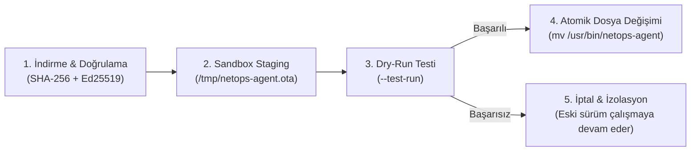

# 🌐 NetOpsWan - Kurumsal SD-WAN & Donanım İşletim Sistemi Master Blueprint

## 1. Projenin Amacı ve Kapsamı (Executive Summary)

**NetOpsWan**, kurumsal şirketlerin dağınık şube ağlarını (merkez ofis, mağazalar, fabrikalar, şubeler) tek bir merkezden şifreli ve merkezi şekilde birbirine bağlayan; **stok Cisco Meraki MX64 ağ donanımlarını açık kaynak tabanlı, yüksek performanslı bir SD-WAN uç cihazına (Edge Gateway) dönüştüren** merkezi yönetim platformudur.

Proje, yüksek donanım ve lisanslama maliyetlerini ortadan kaldırmak amacıyla; **düşük kaynak tüketimli (1 vCPU / 1-2 GB RAM)**, **açık kaynak standartlarına dayalı (WireGuard + Rust + Linux/OpenWrt)** ve **merkezi orkestrasyona sahip** bir SD-WAN ekosistemi sunar.

---

## 2. Sistem Mimarisi ve Katmanlar (Architecture Blueprint)

```mermaid
graph TD
    subgraph "🏢 1. Yönetim & Görsel Katman (Frontend & Orchestration)"
        UI["Next.js 16 (App Router + Turbopack + TailwindCSS)"]
        WIZARD["Initial Setup Wizard (/wizard - Ağ Kartı Seçimi, PSK, SuperAdmin)"]
        STUDIO["Meraki MX64 Provisioning Studio GUI (Desktop Web - scripts/meraki_gui.py)"]
        DASH["Filo Yönetimi, Canlı Telemetri, IPAM, Tehdit Havuzu & NAC"]
    end

    subgraph "⚡ 2. Merkez Sunucu Katmanı (NetOps Hub & Rust Workspace)"
        HUB["apps/netops-hub (Axum + Tokio + Tower REST Gateway)"]
        IPAM_CRATE["crates/netops-ipam (ipnet 2.12 Bitwise IPAM & Overlap Motoru)"]
        AUTH_CRATE["crates/netops-auth (Argon2id Parola & Pre-Shared Secret Doğrulayıcı)"]
        CMD_CRATE["crates/netops-command (Tokio Oneshot Event-Driven Komut Dağıtıcı)"]
        OTA_CRATE["crates/netops-ota (Ed25519 Dijital İmza & SHA-256 Doğrulayıcı)"]
        PROTO_CRATE["crates/netops-proto (Serde Paylaşılan Veri Tipleri)"]
        WG_HUB["WireGuard Linux Çekirdek Modülü (sdwan0: 10.8.0.1/24)"]
        PG["PostgreSQL Veritabanı (netops_users, netops_devices, netops_telemetry)"]
    end

    subgraph "🛡️ 3. Şube Uç Donanım Katmanı (NetOps Edge Agent - Rust Core)"
        AGENT["apps/netops-agent (Rust / ARMv7 musleabi Statik İkili Dosya)"]
        BACKOFF["Akıllı Yeniden Bağlanma (Exponential Backoff 0.4)"]
        SOCKET["Düşük Gecikmeli Soket Yapılandırması (tcp_nodelay: true)"]
        DISCOVERY["Dinamik Arayüz / IP / Subnet Keşfi (/sys, /proc, UCI)"]
        OTA_PIPELINE["5 Kademeli Güvenli OTA Motoru (Staging + Sandbox --test-run + Rollback)"]
    end

    subgraph "📦 4. Donanım & Dağıtım Katmanı (Hardware & Deployment)"
        HARDWARE["Cisco Meraki MX64 (Broadcom BCM58625 Dual-Core ARM Cortex-A9 @ 1.2 GHz)"]
        FLASH["1.0 GB Micron NAND Flash (SquashFS Read-Only + UBI Overlay Writable)"]
        PORTS["1x WAN (Dropbear SSH KAPALI) + 4x LAN (192.168.10.1:22 Parolalı Açık)"]
        ISO["NetOpsWan Netboot Minimal Installer ISO (62MB - Debian Kernel + NetOps Paketi)"]
    end

    UI --> HUB
    WIZARD --> PG
    HUB --> IPAM_CRATE
    HUB --> AUTH_CRATE
    HUB --> CMD_CRATE
    HUB --> OTA_CRATE
    HUB --> PROTO_CRATE
    HUB --> WG_HUB
    HUB --> PG
    AGENT -->|HTTPS + X-NetOps-Secret (TLS 1.3)| HUB
    AGENT -->|WireGuard UDP:51820 Şifreli Tünel (Curve25519)| WG_HUB
    AGENT --> HARDWARE
    FLASH --> HARDWARE
    STUDIO --> HARDWARE
    ISO -.->|Preseed Minimal Kurulum| HUB
```

---

## 3. Rust Multi-Crate Workspace Mimarisi ve Gerçekleşen Yetenekler

Kod tabanı monolitik yapıdan ayrılarak bağımsız ve birim testleri (unit tests) yazılmış modüler crate'lere bölünmüştür:

```text
packages/rust-sdwan/
├── Cargo.toml
├── crates/
│   ├── netops-proto/      # Protokol, telemetri tipleri ve WireGuard veri şemaları
│   ├── netops-ipam/       # ipnet 2.12 ile bitwise IP tahsisi ve overlap tespiti
│   ├── netops-auth/       # Argon2id parola hashleme ve secret doğrulama
│   ├── netops-command/    # Tokio oneshot kanallı event-driven komut dağıtıcı
│   └── netops-ota/        # Ed25519 dijital imza ve SHA-256 bütünlük doğrulayıcı
└── apps/
    ├── netops-hub/        # Axum + Tower + SQLx Merkezi REST Ağ Geçidi
    └── netops-agent/      # Meraki MX64 / ARMv7 musleabi Uç Ajanı
```

### 🦀 A. Modüler Crate'lerin İşlevleri:
1. **`netops-ipam` (IPAM & Subnet Motoru):**
   - `ipnet::Ipv4Net` kullanarak bit seviyesinde dinamik IP tahsisi (`10.8.0.2`, `10.8.0.3` vb.) ve CIDR çakışma kontrolü (Overlap Detection) yapar.
2. **`netops-auth` (Kimlik Doğrulama Motoru):**
   - **Kullanıcı Parolaları:** Bellek-zorlu **`Argon2id`** algoritmasıyla hashlenir.
   - **Cihaz Doğrulaması:** HTTP istek başlığındaki `X-NetOps-Secret` paylaşılan sırrı (Pre-Shared Secret) doğrulanır; eşleşmeyen istekler `HTTP 401 Unauthorized` ile reddedilir.
3. **`netops-command` (Komut Dağıtıcı):**
   - Web arayüzü ile Hub arasındaki komut isteklerini `tokio::sync::oneshot` kanalları üzerinden asenkron olarak eşleştirir.
4. **`netops-ota` (İmza ve Bütünlük Doğrulama):**
   - İndirilen ikili dosyaların **`SHA-256`** özetini ve **`Ed25519`** asimetrik dijital imzasını doğrular.

---

### 🦀 B. Uygulamalar ve Çalışma Mekanizması:
1. **`apps/netops-hub` (Merkezi REST Ağ Geçidi):**
   - `Axum` ve `Tokio` üzerinde asenkron çalışır.
   - Şubelerin WireGuard public key'lerini, sanal IP'lerini ve alt ağlarını yönetir.
2. **`apps/netops-agent` (Şube Uç Ajanı - Meraki MX64 / OpenWrt):**
   - `armv7-unknown-linux-musleabi` hedefiyle statik olarak derlenir (2.4 MB tek ikili dosya).
   - **`backoff`:** Sunucuya ulaşılamadığında kademeli artan Exponential Backoff algoritmasıyla tekrar dener.
   - **Dinamik Keşif:** Cihazın WAN arayüzünü, LAN alt ağını, MAC adresini ve seri numarasını sistem dosyalarından (`/sys`, `/proc`, UCI) dinamik okur.

---

### 🛡️ C. 5 Kademeli Güvenli OTA Pipeline (Staged OTA Execution)

`apps/netops-agent/src/main.rs` içerisindeki OTA güncelleme akışı şu 5 kademeli sırayla çalışır:



1. **İndirme ve Kriptografik Doğrulama:** Dosya indirilir; `netops_ota` ile SHA-256 ve Ed25519 imzası kontrol edilir.
2. **Sandbox Staging:** İndirilen ikili dosya geçici bellek alanına (`/tmp/netops-agent.ota`) yazılır ve `chmod +x` verilir.
3. **Sandbox Dry-Run Testi:** İkili dosya `/tmp/netops-agent.ota --test-run` parametresiyle çalıştırılır. Dosyanın donanım mimarisiyle uyumlu olduğu ve Hub'a test isteği atabildiği doğrulanır. Hata alınırsa dosya silinir ve eski sürüm kesintisiz çalışmaya devam eder.
4. **Atomik Dosya Değişimi (Atomic Swap):** Testi geçen dosya Linux inode rename mekanizması ile atomik olarak `mv -f /tmp/netops-agent.ota /usr/bin/netops-agent` şeklinde taşınır ve servis arka planda yeniden başlatılır.
5. **Watchdog & Kurtarma:** Ajan başladıktan sonra 60 saniye boyunca (ardışık 6 telemetri hatası) Hub ile el sıkışamazsa self-healing mekanizması soketleri ve WireGuard arayüzünü sıfırlar.

---

## 4. Frontend & Yönetim Paneli (Next.js 16 Enterprise Dashboard)

Web katmanı; modern, karanlık mod (Dark Mode) odaklı, anlık reaktif ve kurumsal düzeyde tasarlanmıştır:

1. **Kurulum Sihirbazı (`/wizard`):**
   - **Tek Port (Single-NIC VPS)** veya **Kurumsal Çift Port (Dual-NIC WAN + LAN İzolasyonu)** seçenekleri.
   - Fiziksel ağ kartlarını (`eth0`, `eth1`) dinamik keşfetme.
   - Kriptografik Pre-Shared Secret üretimi ve ilk kurulum kilidi.
2. **Cihaz & Şube Filosu (`/dashboard/fleet`):**
   - Canlı şube listesi, RTT (gecikme), CPU/RAM doluluk oranları.
   - **"İnterneti Kilitle / Aç"** (Tek tıkla şubenin yerel internet çıkışını kesip yalnızca şirket içi tüneli açık bırakma).
   - **Canlı Tanı & Terminal** (Ping, Traceroute, Syslog).
   - Yeni şube eklerken tek tıkla Meraki Flashlama komutu üretimi.
3. **Ağ Topolojisi & Canlı Harita (`/dashboard/topology`):**
   - Hub ve Spoke düğümlerinin anlık bağlantı durumunu gösteren görsel topoloji haritası.
4. **Smart Log Lakehouse & Tehdit İzleme (`/dashboard/threat-logs`):**
   - Şubelerden toplanan şüpheli paketler, drop edilen portlar ve güvenlik olayları.
5. **IPAM, DHCP & Güvenlik Duvarı:**
   - Subnet havuzları, statik IP atamaları ve merkezi UCI kural dağıtımı.

---

## 5. Donanım Flashlama, Saha Araçları & Netboot ISO

1. **Birleşik Saha Provisioner (`scripts/meraki_provisioner.sh`):**
   - Masanızdaki stok Meraki MX64'ü kabloya taktığınızda; Telnet (Diag 192.168.1.1:23) -> U-Boot Flash -> USB RAM Boot -> Kalıcı Micron NAND Flashlama zincirini tek komutla yürütür.
2. **Masaüstü Web GUI Studio (`scripts/start_gui.sh` - `http://127.0.0.1:5050`):**
   - Terminal komutu yazmak istemeyen teknisyenler için tarayıcıda açılan, canlı log pencereli görsel Meraki dönüştürücü.
3. **Pre-Baked Firmware Builder (`firmware_builder/build-firmware.sh`):**
   - Sahada `opkg install` ihtiyacını sıfırlayan; WireGuard, BCM58625 Switch modülleri, QoS (`tc`), Güvenlik Duvarı (`nftables`) ve Rust `netops-agent`'ı içine gömülü olarak derleyen imaj fabrikası.
4. **Debian 12 Netboot Minimal Installer ISO (62 MB):**
   - *Teknik Yapısı:* Tam DVD imajı yerine resmi Debian 12 `netboot` çekirdeği (`vmlinuz`), sıkıştırılmış `initrd.gz`, ISOLINUX bootloader ve NetOpsWan bağımsız paketini barındıran minimal netboot ISO'sudur.
   - Donanımı açar, ağ üzerinden gerekli Debian temel paketlerini unattended preseed ile indirir ve NetOpsWan sunucu paketini kurarak gateway'i hazır hale getirir.

---

## 6. Güvenlik, Ağ İzolasyonu & Tehdit Matrisi

| Tehdit / Saldırı Senaryosu | Alınan Önlem / Mevcut Mekanizma | Güvenlik Etkisi & Notlar |
|---|---|---|
| **Yetkisiz Cihaz Kaydı (Rogue Router)** | **Cihaz-Özel Zero-Trust Token** (`X-Device-Token` / HMAC-SHA256) | Cihazın MAC + ID bileşenlerinden türetilen kriptografik jeton doğrulanır. Bir cihaz ele geçirilse bile diğerleri etkilenmez. |
| **Dışarıdan Dizin Listeleme & Keşif** | Nginx `autoindex off;` yapılandırması | `/downloads/` dizin listelemesi kapatılarak dosya adları gizlenir (`HTTP 403 Forbidden`). |
| **WAN Üzerinden Yönetim Paneline Erişim** | Nginx & Dual-NIC İzolasyonu (`location / { 403 }`) | Dış WAN arayüzünden panel erişimi engellenir. |
| **Şube Router WAN Portundan SSH Sızması** | Firewall `eth0 / wan` port 22 DROP kuralı | Dış WAN arayüzünden gelen SSH paketleri yanıtsız düşürülür (DROP). |
| **Şube İçi Fiziksel Arıza / Bakım** | Sadece Yerel LAN Portunda Parolalı SSH (kurulumda belirlenen, cihaza özel parola) | Saha teknisyenleri için yerel fiziksel erişim sağlanır. |
| **Veritabanı Sızıntısı (Credential Dump)** | Bellek-Zorlu **Argon2id** Kriptografik Hashleme | Rainbow table ve GPU brute-force saldırılarına karşı pratik olarak dayanıklıdır. |
| **Bozuk / Sahte Firmware (OTA Zehirleme)** | **Ed25519** Dijital İmza + **SHA-256** + Sandbox Staging | Sahte veya bozuk ikili dosyalar doğrulama ve staging aşamasında reddedilir. |
| **Ortadaki Adam Dinlemesi (MitM)** | TLS 1.3 + Curve25519 WireGuard Şifreleme | Tünel içi trafik endüstri standardı şifreleme protokolleri ile korunur. |

---

## 7. Gelecek Geliştirme Yol Haritası (Roadmap & Architectural Gaps)

1. **Kapsamlı E2E Staging Laboratuvarı:**
   - CI/CD hattında sanal Meraki QEMU imajları üzerinde OTA güncelleme ve otomatik rollback senaryolarının uçtan uca test edilmesi.
2. **Full-Offline DVD ISO Seçeneği:**
   - Mevcut 62MB Netboot ISO'ya ek olarak, kurulum sırasında internete hiç çıkmayan izole veri merkezleri için tüm Debian bağımlılıklarını içeren ~600MB'lık çevrimdışı (offline) ISO derleme seçeneği eklenmesi.
3. **Donanımsal TPM / Secure Boot Desteği:**
   - Gelecekte donanımında TPM 2.0 veya TrustZone bulunan router modelleri için donanımsal kök güvenlik anahtarı entegrasyonu.


