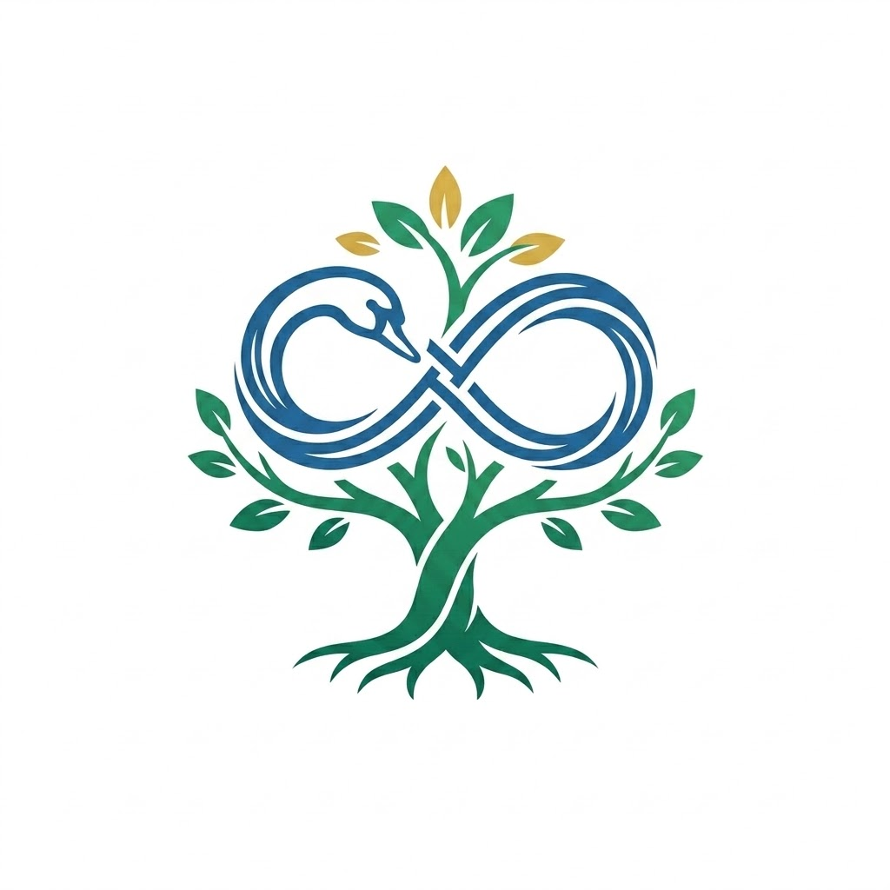
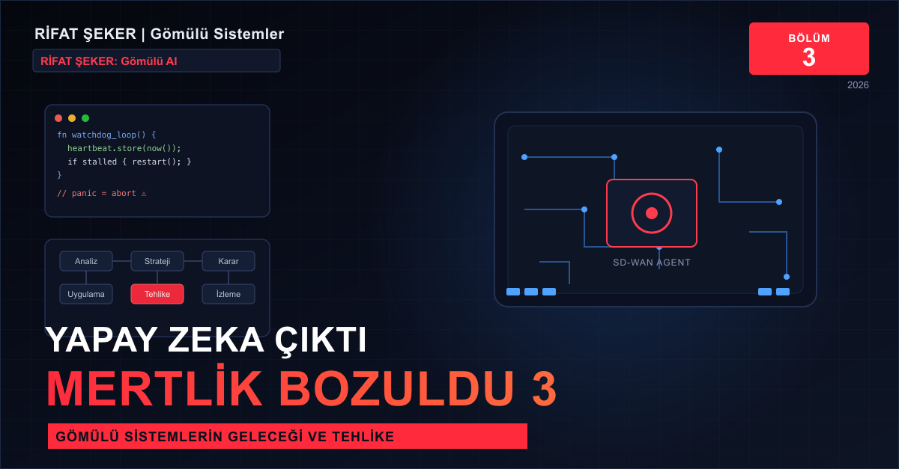
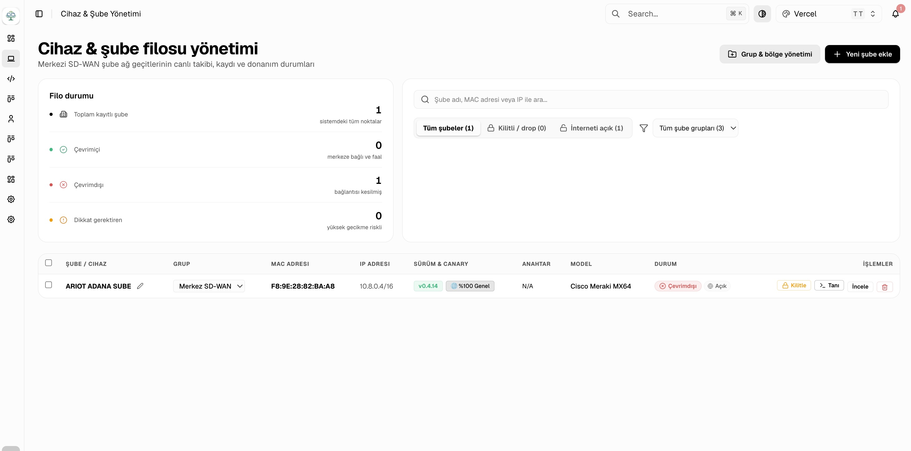
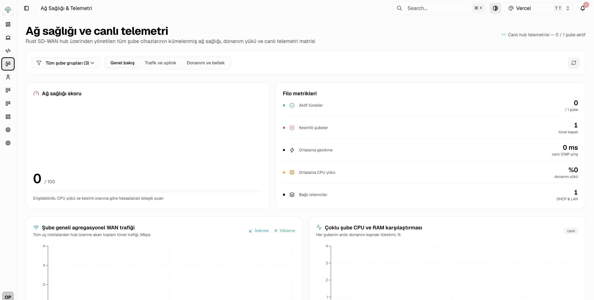
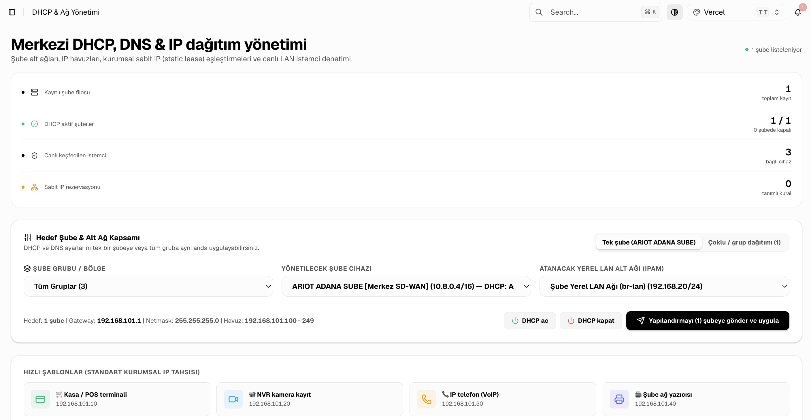
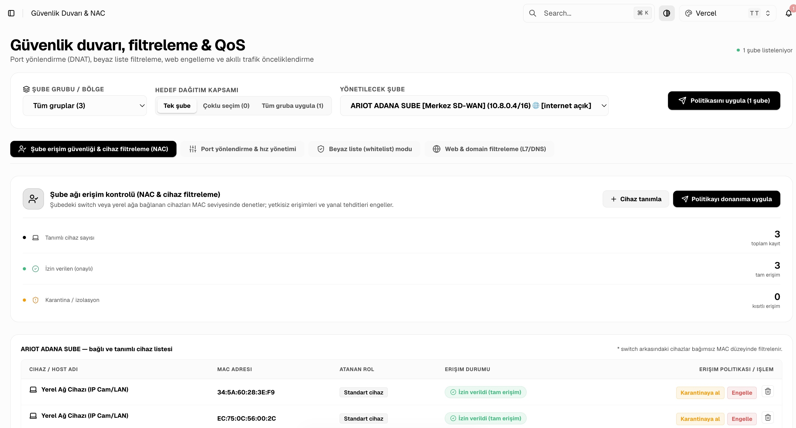
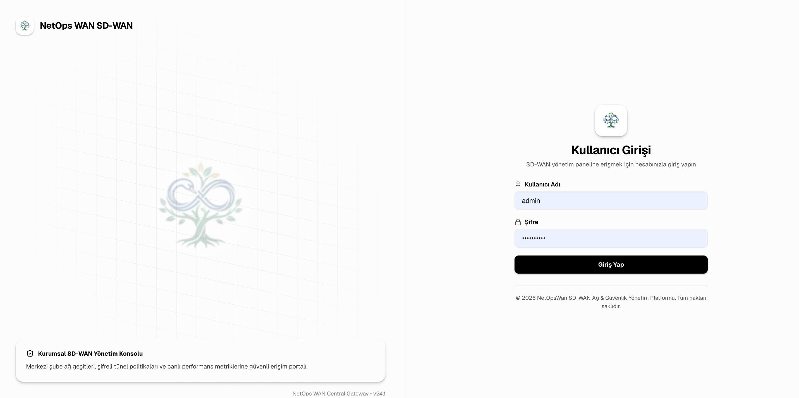
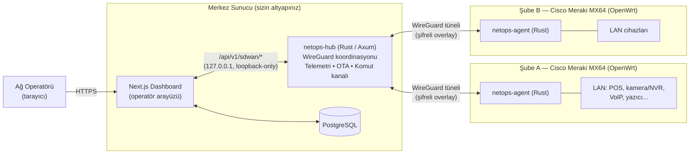

<div align="center">



# NetOpsWan

**Kendi sunucunuzda barındırdığınız, satıcı kilidi olmayan Hub-and-Spoke SD-WAN platformu**

Mevcut Cisco Meraki MX64 donanımınızı Meraki'nin bulut lisansından kurtarıp
kendi Rust yazılımınızla çalıştırın — merkezi bir gösterge panelinden tüm
şubelerinizi, güvenlik duvarlarını, DHCP/DNS'i ve OTA güncellemelerini yönetin.

[](packages/rust-sdwan)
[](frontend)
[](#mimari)
[](#şube-donanımı-cisco-meraki-mx64-dönüşümü)
[](LICENSE)



<p align="center"><em><strong>YAPAY ZEKA ÇIKTI MERTLİK BOZULDU 3:</strong> NetOpsWan SD-WAN — Cisco Meraki MX64 cihazlarının stok bulut lisanslı firmware'i yerine kendi geliştirdiğimiz açık kaynak firmware ve otonom Rust ajan devrimi!</em></p>

<br />



<p align="center"><strong>Canlı Sistem Görünümü:</strong> Cisco Meraki MX64 cihaz filosu, WireGuard tünel durumları ve merkezi yönetim konsolu</p>

</div>

---

## İçindekiler

- [English summary](#english-summary)
- [Bu proje ne, neden var?](#bu-proje-ne-neden-var)
- [Ekran görüntüleri ve canlı gösterge paneli](#ekran-görüntüleri-ve-canlı-gösterge-paneli)
- [Mimari: nasıl çalışıyor?](#mimari-nasıl-çalışıyor)
- [Öne çıkan özellikler](#öne-çıkan-özellikler)
- [Teknoloji yığını](#teknoloji-yığını)
- [Repo yapısı](#repo-yapısı)
- [Hızlı başlangıç](#hızlı-başlangıç)
- [Ortam değişkenleri — hangi şifre nereye yazılır?](#ortam-değişkenleri--hangi-şifre-nereye-yazılır)
- [Şube donanımı: Cisco Meraki MX64 dönüşümü](#şube-donanımı-cisco-meraki-mx64-dönüşümü)
- [Güvenlik modeli ve üretime almadan önce](#güvenlik-modeli-ve-üretime-almadan-önce)
- [Geliştirme ve test](#geliştirme-ve-test)
- [Yol haritası](#yol-haritası)
- [Katkıda bulunma](#katkıda-bulunma)
- [Lisans](#lisans)

---

## English summary

NetOpsWan is a self-hosted, hub-and-spoke SD-WAN platform. A central Rust
service (`netops-hub`) coordinates WireGuard tunnels to lightweight Rust
agents (`netops-agent`) running on branch routers — including repurposed
Cisco Meraki MX64 hardware reflashed to OpenWrt, freed from Meraki's
cloud-licensed firmware. A Next.js dashboard gives network operators one
place to see branch health, manage DHCP/DNS and firewall/NAC rules, roll
out Ed25519-signed OTA firmware updates, and diagnose problems on remote
hardware — without SSHing into every device by hand. See the sections
below (in Turkish, the team's working language) for architecture, setup,
and security notes; the code comments are also in Turkish.

---

## Bu proje ne, neden var?

Perakende/kurumsal şube ağı olan bir işletmenin, onlarca-yüzlerce şubesindeki
ağ cihazlarını (router, güvenlik duvarı, DHCP/DNS, VPN tüneli) **tek bir
merkezi panelden** yönetebilmesi için yazıldı.

Ticari SD-WAN çözümleri (Cisco Meraki, Cato, vb.) bunu çok iyi yapar — ama
donanımı bulut lisansına kilitler: aboneliğiniz bitince cihazlar işe
yaramaz hale gelir, ve trafiğiniz/telemetriniz üçüncü bir bulut kontrol
düzlemi üzerinden geçer.

**NetOpsWan'ın önerdiği yol:** Elinizde zaten duran Cisco Meraki MX64
donanımını (Broadcom BCM58625, ARMv7) Meraki'nin bulut yazılımından
kurtarıp OpenWrt ile yeniden flaşlayın, üzerine bu projenin kendi hafif
Rust ajanını (`netops-agent`) kurun. Artık o cihaz, sizin kendi
sunucunuzdaki `netops-hub`'a WireGuard üzerinden bağlanan, tamamen sizin
kontrolünüzdeki bir SD-WAN uç noktası. Ne aylık lisans, ne üçüncü taraf
bulut bağımlılığı, ne de "satıcı yarın bu özelliği kaldırırsa ne olur"
kaygısı.

Bu depo, bu fikrin gerçek bir işletmede (ARIOT) üretimde çalışan tam
uygulamasıdır: merkez sunucu, saha ajanı, ve ikisini yöneten bir web
panosu.

## Ekran görüntüleri ve canlı gösterge paneli

NetOpsWan'ın Next.js 16 ve TailwindCSS tabanlı modern operatör gösterge paneli; sahada çalışan tüm Cisco Meraki MX64 uç noktalarını, WireGuard tünellerini, yerel alt ağları ve güvenlik duvarı kurallarını canlı olarak yönetir:

### 1. Cihaz & Şube Filosu Yönetimi
OpenWrt ve `netops-agent` yüklü Cisco Meraki MX64 cihazının canlı takibi, WireGuard tünel IP'si (`10.8.0.4/16`), ajan sürümü (`v0.4.14`), uzaktan donanım tanısı ve tek tıkla şube kilitleme eylemleri:

<div align="center">
  
</div>

### 2. Ağ Sağlığı ve Canlı Telemetri
Şube bazlı gecikme (latency), CPU/RAM yükü, anlık ICMP ping metrikleri ve agregasyonel WAN trafiği izleme:

<div align="center">
  
</div>

### 3. Merkezi DHCP, DNS & IP Dağıtımı
Kasa/POS terminali, NVR kamera, VoIP telefon ve şube yazıcıları için hazır şablonlarla tek tıkla IP havuzu ve statik lease tahsisi:

<div align="center">
  
</div>

### 4. Güvenlik Duvarı, Zero-Trust NAC ve Filtreleme
Şube yerel ağındaki cihazların (IP kamera, PC vb.) switch arkasında MAC seviyesinde denetimi; tek tıkla karantinaya alma ve politika uygulama:

<div align="center">
  
</div>

### 5. Giriş ve Kimlik Doğrulama Portalı
Merkezi kurumsal SD-WAN ağ geçidi ve güvenli operatör giriş konsolu:

<div align="center">
  
</div>

## Mimari: nasıl çalışıyor?



Üç ana bileşen:

1. **`netops-hub`** (`packages/rust-sdwan/crates/netops-hub`) — merkez
   sunucuda çalışan Rust/Axum servisi. Her şube ajanının WireGuard
   kayıt/telemetri isteklerini karşılar, tünel havuzunu (IPAM) yönetir,
   cihaz durumunu (ACTIVE/DEGRADED/OFFLINE) canlı tutar, imzalı OTA
   güncellemelerini sunar ve şubeye uzaktan komut (tanı, NAC engelle/aç,
   yapılandırma) gönderme kanalını işletir.
2. **`netops-agent`** (`packages/rust-sdwan/crates/netops-agent`) — şube
   donanımında (OpenWrt) çalışan hafif Rust ajanı. Kendi MAC/donanım
   kimliğini otomatik keşfeder, hub'a kayıt olur, WireGuard tünelini
   kurar, periyodik telemetri gönderir, hub'dan gelen komutları yürütür,
   ve Ed25519 imzalı OTA güncellemelerini güvenli şekilde uygular.
3. **`frontend`** — operatörlerin kullandığı Next.js 16 / shadcn tabanlı
   Türkçe gösterge paneli: filo görünümü, topoloji haritası, DHCP/DNS,
   güvenlik duvarı/NAC, PKI sertifikaları, tehdit logları, OTA dağıtımı.

Hub ile agent arasındaki her kanal (kayıt, telemetri, komut) bir
paylaşılan-sır tabanlı cihaz jetonu (`X-Device-Token`) ile doğrulanır;
OTA güncellemeleri SHA-256 bütünlük + Ed25519 imza ile korunur (bkz.
[Güvenlik modeli](#güvenlik-modeli-ve-üretime-almadan-önce)).

## Öne çıkan özellikler

- **Sıfır-dokunuşla şube kaydı** — MAC, WAN arayüzü, LAN alt ağı elle
  girilmez; ajan donanımı kendisi keşfeder ve hub'a kaydolur.
- **Kendi kendini onaran WireGuard mesh'i** — tünel koptuğunda otomatik
  yeniden kayıt/yeniden kurulum; hub tarafında peer canlılığını hem HTTP
  telemetri hem çekirdek WireGuard handshake'i ile çift kanaldan izleyen
  bir "reaper" görevi.
- **Görev-seviyesi dayanıklılık** — hem hub hem agent'taki her uzun-ömürlü
  arka plan görevi (tünel bekçisi, telemetri döngüsü, güvenlik olay
  kaydı, anomali motoru...) bir "nabız + bekçi köpeği" mekanizmasıyla
  izlenir: bir görev sessizce çöker ya da askıda kalırsa süreç kendini
  temiz bir durumdan yeniden başlatır.
- **Merkezi DHCP/DNS** — sabit IP atamaları, POS/kamera/VoIP/yazıcı için
  hazır hızlı-atama şablonları, şube veya grup bazlı toplu dağıtım.
- **Zero-Trust NAC** — herhangi bir istemci cihazı MAC adresinden şube
  güvenlik duvarında anında engelle/aç.
- **Ed25519 imzalı, sandbox'lı OTA** — imzasız/bozuk bir firmware asla
  kabul edilmez; yeni sürüm önce cihazda bir sandbox testinden geçirilir,
  başarısız olursa eski çalışan sürüm korunur (atomik, geri alınabilir
  güncelleme).
- **Sıfır-yapılandırma kamera/NVR trafik yönetimi** — RTSP port imzasına
  bakarak otomatik bant genişliği sınırlama, elle IP/kamera tanımlamaya
  gerek yok.
- **Şubeler-arası köprüleme** — bir şubenin LAN alt ağını hub üzerinden
  başka bir şubeye yönlendirme.
- **PKI sertifika takibi**, canlı tehdit/güvenlik olay logları (DuckDB
  benzeri hafif bir "Smart Log Engine" ile), gerçek zamanlı SSE akışları.

## Teknoloji yığını

| Katman | Teknoloji |
|---|---|
| Merkez Hub | Rust, [Axum](https://github.com/tokio-rs/axum), Tokio async runtime |
| Şube Ajanı | Rust (ARMv7 / soft-float, OpenWrt hedefli statik binary) |
| Tünel | [WireGuard](https://www.wireguard.com/) |
| Dashboard | Next.js 16, React, TypeScript, shadcn/ui, TanStack Query/Form |
| Veritabanı | PostgreSQL (dashboard verisi), hub'ın kendi hafif log motoru |
| Kimlik doğrulama (dashboard) | Clerk (opsiyonel — keyless modda da çalışır) |
| OTA güvenliği | SHA-256 bütünlük + Ed25519 imza |
| Parola hashleme | Argon2id |
| Şube donanımı | Cisco Meraki MX64 → OpenWrt (yeniden flaşlanmış) |
| Konteynerleştirme | Docker Compose (OpenWISP/PostgreSQL/Redis/InfluxDB altyapısı için) |

## Repo yapısı

```
NetOpsWan/
├── packages/rust-sdwan/          # Rust workspace
│   └── crates/
│       ├── netops-hub/           # Merkez sunucu servisi
│       ├── netops-agent/         # Şube (OpenWrt) ajanı
│       ├── netops-proto/         # Hub↔Agent ortak protokol tipleri
│       ├── netops-auth/          # Zero-Trust cihaz jetonu, JWT, Argon2id
│       ├── netops-ota/           # Ed25519/SHA-256 OTA imzalama + doğrulama
│       ├── netops-ipam/          # Tünel IP havuzu yönetimi
│       └── netops-command/       # Uzaktan komut/tanı protokolü
├── frontend/                     # Next.js 16 operatör gösterge paneli
├── firmware_builder/             # Meraki MX64 → OpenWrt firmware üretim script'leri
├── scripts/                      # Provisioning, e2e test, göç araçları
├── docker-compose.yml            # OpenWISP + PostgreSQL/Redis/InfluxDB altyapısı
├── install.sh                    # Tek komutla sunucu kurulum sihirbazı
└── docs/                         # Ek dokümantasyon ve görseller
```

## Hızlı başlangıç

### Gereksinimler

- Rust 1.90+ (`rustup`)
- Node.js 20+ ve `npm`/`bun`
- PostgreSQL 14+
- Docker + Docker Compose (OpenWISP altyapısı için, opsiyonel)
- Bir Linux sunucu (merkez Hub için) ve/veya test için yerel makineniz
- Şube donanımı olarak denemek isterseniz: bir Cisco Meraki MX64 (bkz.
  [Şube donanımı](#şube-donanımı-cisco-meraki-mx64-dönüşümü))

### 1. Depoyu klonlayın ve ortam dosyalarını hazırlayın

```bash
git clone https://github.com/<kullanici-adiniz>/netopswan.git
cd netopswan
cp .env.example .env
cp frontend/env.example.txt frontend/.env.local
```

Şimdi [Ortam değişkenleri](#ortam-değişkenleri--hangi-şifre-nereye-yazılır)
bölümüne geçip `.env` ve `frontend/.env.local` içindeki tüm
`CHANGE_ME_...` değerlerini kendi şifrelerinizle doldurun.

### 2. Rust Hub'ı derleyin ve çalıştırın

```bash
cd packages/rust-sdwan
cargo build --release -p netops-hub
./target/release/netops-hub \
  --shared-secret "$(openssl rand -hex 32)" \
  --agent-version 0.4.14
```

> `--agent-version` argümanını **her zaman açıkça** verin ve şube
> ajanlarınızın gerçek sürümüyle eşleştirin — boş bırakırsanız hub kendi
> paket sürümünü "ajan hedef sürümü" sanar, bu da OTA'nın yanlışlıkla
> eski bir binary'ye "düşürme" (downgrade) yapmasına yol açabilir.

### 3. Dashboard'u çalıştırın

```bash
cd frontend
npm install
npm run dev
```

Panel `http://localhost:3000` adresinde açılır.

### 4. (Opsiyonel) OpenWISP altyapısını Docker ile ayağa kaldırın

```bash
docker compose up -d
```

veya prod bir sunucuda tek komutla:

```bash
sudo ./install.sh
```

### 5. Şube ajanını derleyin (çapraz derleme)

```bash
cd packages/rust-sdwan
cross build --release --target armv7-unknown-linux-musleabi -p netops-agent
```

Üretilen binary'yi cihaza kopyalayıp çalıştırmak için
[Şube donanımı](#şube-donanımı-cisco-meraki-mx64-dönüşümü) bölümüne
bakın.

## Ortam değişkenleri — hangi şifre nereye yazılır?

Bu proje **iki ayrı** ortam dosyası kullanır. İkisini de `CHANGE_ME_...`
ile başlayan her değeri **kendi** güçlü/rastgele değerlerinizle
doldurarak hazırlayın — hiçbirini örnekteki gibi bırakmayın.

### A) Kök dizin — `.env` (OpenWISP / Docker Compose altyapısı için)

Örnek dosya: [`.env.example`](.env.example) → kopyalayıp `.env` yapın.

| Değişken | Ne işe yarar | Nereden alınır / nasıl üretilir |
|---|---|---|
| `SERVER_DOMAIN`, `SERVER_IP` | Sunucunuzun dışa açık domaini/IP'si | Kendi domaininiz/IP'niz |
| `PANEL_PORT` | Next.js panelinin dinleyeceği port | Genelde `3000` |
| `OPENWISP_API_TOKEN` | OpenWISP API'sine dahili erişim jetonu | `openssl rand -hex 20` ile üretin |
| `DB_USER`, `DB_PASS` | OpenWISP PostgreSQL kullanıcı/şifresi | `DB_PASS` için `openssl rand -base64 24` |
| `DJANGO_SECRET_KEY` | Django'nun oturum/CSRF imzalama anahtarı | `python3 -c "import secrets; print(secrets.token_urlsafe(50))"` |

### B) `frontend/.env.local` (Next.js dashboard için)

Örnek dosya: [`frontend/env.example.txt`](frontend/env.example.txt).

| Değişken | Ne işe yarar | Nereden alınır |
|---|---|---|
| `DB_HOST`, `DB_PORT`, `DB_NAME`, `DB_USER`, `DB_PASSWORD` | Dashboard'un kendi PostgreSQL bağlantısı | Kendi Postgres sunucunuz |
| `SDWAN_HUB_URL` | `netops-hub`'ın dahili adresi (varsayılan `http://127.0.0.1:8088`) | Hub'ı aynı sunucuda çalıştırıyorsanız değiştirmenize gerek yok |
| `INTERNAL_SYNC_SECRET` | Dashboard'un kendi kendine (arka plan senkron görevi) çağırdığı iç API'yi korur | `openssl rand -hex 32` |
| `NEXT_PUBLIC_CLERK_PUBLISHABLE_KEY`, `CLERK_SECRET_KEY` | Kullanıcı girişi (Clerk) — **boş bırakılabilir**, "keyless mode" ile panel yine çalışır | [clerk.com](https://clerk.com) → kendi projeniz |
| `WEBHOOK_SECRET` | Clerk webhook doğrulaması (opsiyonel) | Clerk Dashboard → Webhooks |
| `NEXT_PUBLIC_SENTRY_DSN` ve diğer Sentry değişkenleri | Hata izleme (opsiyonel) | [sentry.io](https://sentry.io) → kendi projeniz |

### C) Hub'ın kendi çalışma-zamanı sırları (CLI argümanı / kalıcı süreç yöneticisi)

`.env` dosyasında değil, `netops-hub`'ı başlatırken CLI argümanı olarak
verilir (örn. `pm2`/`systemd` servis tanımınıza yazın):

| Argüman | Ne işe yarar |
|---|---|
| `--shared-secret` | Tüm şube ajanlarıyla paylaşılan kök Zero-Trust sırrı. `openssl rand -hex 32` ile üretin, **asla** kod/repo içine yazmayın. |
| `--agent-version` | Filodaki ajanların GERÇEK sürümü (yukarıdaki uyarıya bakın). |
| `--tunnel-subnet` | WireGuard tünel havuzu (varsayılan `10.8.0.0/16`). |

### D) Şube cihazı sırları

Her şube cihazının kendi `/etc/netops/shared_secret` dosyası, hub'ın
`--shared-secret` değeriyle **aynı olmalıdır** (ya da provisioning
sırasında üretilen cihaza-özel bir jeton — bkz. `netops_provisioner.sh
--device-key`). Şubenin **yerel LAN kurtarma SSH şifresi** ise
`firmware_builder/build-firmware.sh` çalıştırılırken `SSH_PASSWORD`
ortam değişkeni ile verilir — depoda hiçbir varsayılan/gerçek şifre
**bırakılmamıştır**, script bu değer verilmeden çalışmayı reddeder.

> ⚠️ **Önemli:** Bu depo daha önce özel/kapalı bir ortamda geliştirildi
> ve bir noktada gerçek bir üretim şifresi kod içinde yer almıştı. Bu
> depo public'e alınmadan önce o değer temizlendi — ama **eğer bu kodu
> zaten üretimde çalıştırıyorsanız, ilgili cihazlardaki ve
> hesaplardaki tüm şifreleri/sırları hemen rotasyona sokun** (LAN
> kurtarma şifresi, `shared_secret`, veritabanı şifreleri, `.env`
> içindeki tüm değerler). Bir deponun geçmişte özel olması, geçmiş
> commit'lerin hiçbir zaman görülmeyeceği anlamına gelmez.

## Şube donanımı: Cisco Meraki MX64 dönüşümü ve Agent Kurulumu

NetOpsWan, stok Cisco Meraki MX64 güvenlik cihazlarını (Broadcom BCM58625, Dual-Core ARM Cortex-A9, 2GB DDR3 RAM, 1GB NAND Flash) üretici bulut kilitlerinden kurtararak açık kaynaklı, otonom bir SD-WAN uç noktasına dönüştürmek için özel araçlar içerir.

Bu otomasyon araçları `tools/meraki-mx64/` altında konumlandırılmıştır.

```
tools/meraki-mx64/
├── mx64-tool              # Python tabanlı CLI yönetim ve otomasyon aracı
├── mx64_tool/             # Otomatik tespit, flash ve tam yedekleme motoru
├── scripts/               # Yardımcı bash scriptleri (IP değişimi, sysupgrade vb.)
├── studio.py              # Web tabanlı Staging & Provisioning Studio
└── backups/               # Orijinal stok Meraki flash yedekleri arşivi
```

### 1. Stok Cihazın TAM Flash Yedeğini Alma (`backup-full`)

Cihaza herhangi bir müdahale yapmadan önce, stok Meraki bulut yazılımına ileride **orijinal haline dönebilmek** için tüm MTD flash bölümlerini (bootloader, kernel, rootfs, nvram) bilgisayarınıza yedekleyin:

```bash
cd tools/meraki-mx64
./mx64-tool backup-full --iface <ethernet-arayuzu> --host-ip 192.168.1.2
```

- **%100 Salt-Okunur:** Cihaz üzerinde hiçbir şeyi silmez veya değiştirmez.
- MTD haritasındaki tüm bölümleri (`orig_mtd0_boot.bin`, `orig_mtd3_nvram.bin` vb.) `backups/` dizinine adlandırılmış olarak indirir.

### 2. Tek Komutla Otomatik Açık Kaynak Dönüşümü

Cihazı sıfırlama (reset) butonuna basılı tutarak açıp Diag moduna (Telnet: `192.168.1.1:23`) aldıktan sonra sihirbazı çalıştırın:

```bash
sudo ./mx64-tool run
```

Bu sihirbaz sırasıyla:
1. **Donanım ve SoC Revizyonunu Keşfeder:** Standart MX64 veya A0 revizyonunu otomatik ayırır.
2. **U-Boot Flaşlar:** MTD yazma kilidini açıp açık kaynak `uboot_mx64` bootloader'ını yazar.
3. **USB Bellek Hazırlar:** Clayface kararlı initramfs kernel'ını USB sürücüye yönlendirir.
4. **Kalıcı OpenWrt Sysupgrade Yapar:** NAND Flash'a kalıcı OpenWrt işletim sistemini yazar ve cihazı `192.168.10.1/24` IP'siyle yeniden başlatır.

### 3. Rust SD-WAN Ajanının (`netops-agent`) Kurulumu ve Servis Başlatma

Cihaz kalıcı OpenWrt ile açıldıktan sonra yerel ağdan bağlanın:

```bash
# İlk kurulumda şifre boştur, direkt Enter'a basın:
ssh root@192.168.10.1
```

Geliştirilen Rust ajanı ARMv7 için çapraz derlenip cihaza yüklenir:

```bash
# Bilgisayarınızda Rust ajanını çapraz derleyin:
cd packages/rust-sdwan
cross build --release --target armv7-unknown-linux-musleabi -p netops-agent

# Binary'yi MX64 cihazına kopyalayın:
scp target/armv7-unknown-linux-musleabi/release/netops-agent root@192.168.10.1:/usr/bin/netops-agent
```

Cihaz üzerinde Zero-Trust gizli anahtarını ve otomatik başlatma servisini tanımlayın:

```sh
# Cihaz terminalinde:
chmod +x /usr/bin/netops-agent
mkdir -p /etc/netops

# Hub ile paylaşılan kök sırrı cihaza yazın:
echo -n "<PAYLASILAN_ZERO_TRUST_SIRRI>" > /etc/netops/shared_secret
chmod 600 /etc/netops/shared_secret

# Servis oluşturun (/etc/init.d/netops-agent):
cat << 'EOF' > /etc/init.d/netops-agent
#!/bin/sh /etc/rc.common
START=95
STOP=10
USE_PROCD=1

start_service() {
    procd_open_instance
    procd_set_param command /usr/bin/netops-agent --hub-url "https://<HUB_DOMAIN_VEYA_IP>"
    procd_set_param respawn 3600 5 0
    procd_set_param stdout 1
    procd_set_param stderr 1
    procd_close_instance
}
EOF

chmod +x /etc/init.d/netops-agent
/etc/init.d/netops-agent enable
/etc/init.d/netops-agent start
```

Artık Cisco MX64 cihazınız:
- Kendi benzersiz MAC kimliğini ve donanım metriklerini okur,
- Hub sunucusuna güvenli `X-Device-Token` (HMAC-SHA256) ile kaydolur,
- WireGuard tünelini otomatik ayağa kaldırır,
- Next.js Dashboard'unuzdaki **Filo Yönetimi** haritasında canlı olarak görünür!

#### Detaylı Referans Dokümanları
- 📘 [Cisco Meraki MX64 Cihaz & Sistem Blueprint](docs/cisco-mx64-device-blueprint.md)
- 🛠️ [Cisco Meraki MX64 Manuel Kurulum & IP Çakışma Rehberi](docs/cisco-mx64-manual-setup.md)
- 🚑 [Cisco Meraki MX64 Unbrick ve Geri Dönüş (Recovery) Kılavuzu](docs/cisco-mx64-recovery-guide.md)

## Güvenlik modeli ve üretime almadan önce

- **Zero-Trust cihaz jetonu** — her ajan, kendi MAC adresi + cihaz ID'si
  + paylaşılan sır ile HMAC-SHA256 türetilmiş benzersiz bir jetonla
  kimlik kanıtlar; bir cihazın jetonu ele geçirilse bile diğer
  cihazları taklit edemez.
- **Argon2id** ile parola hashleme (kullanıcı hesapları).
- **Ed25519 imza + SHA-256 bütünlük** ile korunan OTA — imzasız/bozuk
  firmware fail-closed olarak reddedilir; yeni sürüm sandbox'ta test
  edilmeden kalıcı hale gelmez.
- **WAN üzerinden SSH tamamen kapalı** — şube cihazlarına sadece yerel
  LAN üzerinden fiziksel erişimle SSH yapılabilir.
- **Yönetimsel API'ler loopback-only** — `commands/exec`, `peers` gibi
  hassas uç noktalar sadece `127.0.0.1` üzerinden (dashboard'un kendi
  sunucu tarafı) erişilebilir, WAN'dan asla.
- Bu depoyu **kendi altyapınızda** çalıştırmadan önce mutlaka:
  1. `.env` ve `frontend/.env.local` içindeki **her** `CHANGE_ME_...`
     değerini kendi rastgele üretilmiş sırlarınızla değiştirin.
  2. `--shared-secret` ve her şube cihazının LAN kurtarma şifresini
     kendiniz üretin — depoda hiçbir varsayılan şifre yoktur.
  3. Hub'ınızı bir ters proxy (nginx/Caddy) arkasında, geçerli bir TLS
     sertifikasıyla (Let's Encrypt) yayınlayın; `nginx/` klasöründeki
     örnek yapılandırmayı kendi domaininize göre uyarlayın.

## Geliştirme ve test

```bash
# Rust: tüm testleri çalıştır
cd packages/rust-sdwan
cargo test --workspace

# Rust: linting
cargo clippy --workspace

# Frontend: tip kontrolü
cd frontend
npm run typecheck

# Frontend: linting
npm run lint

# Şube ajanını çapraz derle (ARMv7 / OpenWrt)
cd packages/rust-sdwan
cross build --release --target armv7-unknown-linux-musleabi -p netops-agent
```

## Yol haritası

Bkz. [`BLUEPRINT.md`](BLUEPRINT.md) § 7 — bilinen mimari boşluklar ve
planlanan geliştirmeler (ör. OTA'nın indirilen dosyanın beyan edilen
sürümünü de doğrulaması, HA hub failover'ın daha geniş test kapsamı).

## Katkıda bulunma

Sorun bildirimleri ve pull request'ler memnuniyetle karşılanır. Büyük bir
değişiklik göndermeden önce lütfen bir issue açıp yaklaşımınızı
tartışalım — özellikle güvenlik-kritik alanlarda (OTA doğrulama, cihaz
kimlik doğrulama) değişiklik öneriyorsanız.

## Lisans ve Ticari Model (Dual-Licensing)

Bu proje, hem açık kaynak topluluğunu destekleyen hem de kurumsal ve ticari kullanımlarda geliştirici haklarını koruyarak sürdürülebilir bir gelir modeli sunan **Çift Lisanslama (Dual-Licensing: AGPLv3 + Ticari Kurumsal Lisans)** modeli ile korunmaktadır:

### 1. Açık Kaynak Topluluk Lisansı — GNU AGPLv3
NetOpsWan'ın kaynak kodları, [GNU Affero General Public License v3.0 (AGPL-3.0)](LICENSE) altında kamuya açıktır.
- **Kimler ücretsiz kullanabilir?** Bireysel geliştiriciler, hobi amaçlı ağ kuranlar, üniversiteler, açık kaynak araştırmacıları ve kendi kurum içi altyapısında kaynak kodları değiştirmeden çalıştıranlar.
- **Copyleft / Ağ Koruması (Anti-SaaS Kuralı):** Bu platformu veya modüllerini değiştirip bir ağ üzerinden (SaaS, Bulut SD-WAN, MSP veya yönetilen servis sağlayıcı olarak) üçüncü kişilere sunan herhangi bir kişi ya da kurum, sisteme yaptığı tüm eklemeleri ve entegre ettiği kodları da **AGPLv3 altında kamuya açık kaynak olarak sunmak zorundadır**.

### 2. Ticari ve Kurumsal Lisans (Commercial Enterprise License)
Eğer şirketiniz NetOpsWan'ı:
- Kaynak kodlarınızı kamuya açma zorunluluğundan (AGPLv3 kopyalama/dağıtım şartlarından) muaf olarak kullanmak,
- Kendi tescilli (closed-source) donanım, ürün veya ticari yazılım paketlerinize entegre etmek,
- Müşterilerinize ücretli, ticari bir SD-WAN servisi / cihaz bundle'ı olarak satmak,
- Kurumsal SLA, garantili teknik destek, özel donanım adaptasyonu (farklı router/SoC desteği) ve mimari danışmanlık ile devreye almak istiyorsa;

Doğrudan geliştirici ve telif hakkı sahibi **Rifat Şeker** tarafından sağlanan **Ticari / Kurumsal Lisans** edinilmelidir.

> 💼 **Ticari Lisanslama & Kurumsal İletişim:**  
> Kurumsal lisanslama, SLA anlaşmaları, donanım tedarik ve iş ortaklığı görüşmeleri için lütfen iletişime geçin:  
> **Rifat Şeker** · ARIOT

---

<div align="center">

Rifat Şeker tarafından geliştirilmektedir · ARIOT

</div>
