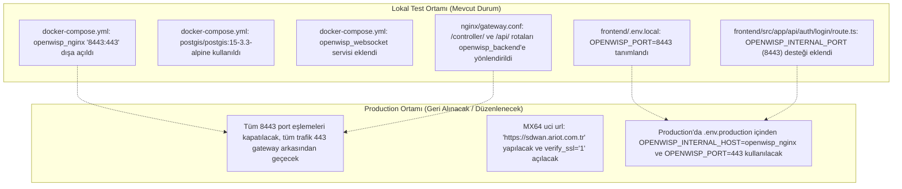

# 📝 NetOpsWan - Lokal Demo / Canlı Test Değişiklikleri & Production Geri Alma Kılavuzu

Bu belge, lokal geliştirme ortamında (Mac OS) ve **Cisco Meraki MX64** cihazında canlı demoyu / testleri sorunsuz koşturabilmek amacıyla yapılan geçici yapılandırmaları ve sistem gerçek canlı ortama (**Production / `sdwan.ariot.com.tr`**) taşındığında geri alınması gereken maddeleri belgeler.

---

## 1. Lokal Test İçin Yapılan Değişiklikler Özeti



---

## 2. Dosya Bazlı Yapılan Değişiklikler ve Production Geri Alma Adımları

### A. `docker-compose.yml`
* **Yapılan Değişiklik:**
  1. `openwisp_nginx` servisine `ports: - "8443:443"` eklendi (Next.js'in ve lokal testlerin doğrudan Nginx SSL bacağına erişebilmesi için).
  2. `websocket` servisi (`openwisp/openwisp-websocket:edge`) eksikti, eklendi ve `openwisp_nginx` upstream'i bağlandı.
  3. `postgres` servisi standart `postgres:15-alpine` yerine PostGIS gereksinimi için `postgis/postgis:15-3.3-alpine` olarak değiştirildi.
* **Production'a Geçerken:**
  - `ports: - "8443:443"` satırını kaldırın / yoruma alın. Tüm istekler sadece merkezi `netopswan-gateway` (Port 80/443) üzerinden geçmelidir.
  - `postgis/postgis:15-3.3-alpine` ve `websocket` tanımları kalıcı olmalıdır (Production için de zorunludur).

---

### B. `nginx/gateway.conf`
* **Yapılan Değişiklik:**
  - Şube cihazlarının kayıt ve telemetri gönderebilmesi için `/controller/` ve `/api/` rotaları eklendi:
    ```nginx
    location /controller/ {
        proxy_pass https://openwisp_backend;
        proxy_ssl_verify off;
        proxy_set_header Host api.openwisp.org;
        proxy_set_header X-Real-IP $remote_addr;
        proxy_set_header X-Forwarded-For $proxy_add_x_forwarded_for;
        proxy_set_header X-Forwarded-Proto $scheme;
        proxy_read_timeout 90s;
    }
    ```
* **Production'a Geçerken:**
  - Bu bloklar **kalıcı olmalıdır**. Production ortamında `Host` başlığı gerçek domain adınız (`sdwan.ariot.com.tr` veya `api.sdwan.ariot.com.tr`) ile güncellenmelidir.

---

### C. `frontend/.env.local` ve `frontend/src/app/api/auth/login/route.ts`
* **Yapılan Değişiklik:**
  - Lokal Next.js backend'inin SSL sertifika uyuşmazlığına takılmadan lokal Nginx'e erişmesi için `OPENWISP_PORT=8443` ve `OPENWISP_INTERNAL_PORT=8443` tanımlandı.
* **Production'a Geçerken:**
  - Docker üzerinde frontend konteyneri çalıştırılırken `OPENWISP_INTERNAL_HOST=openwisp_nginx` ve `OPENWISP_PORT=443` kullanılacaktır. `route.ts` dosyasına eklenen dinamik ortam değişkeni desteği sayesinde kodda değişiklik yapmaya gerek kalmadan sadece `.env` ile production moduna uyum sağlar.

---

### D. `frontend/src/app/auth/login/page.tsx` & `frontend/src/components/org-switcher.tsx`
* **Yapılan Değişiklik:**
  - Next.js 16 standartlarına uygun olarak `Image` etiketlerine `sizes` prop'ları eklendi.
* **Production'a Geçerken:**
  - **Kalıcıdır**, geri alınmasına gerek yoktur.

---

### E. Cisco Meraki MX64 (Uç Cihaz) Yapılandırması
* **Yapılan Değişiklik:**
  - `/etc/hosts` dosyasına `192.168.10.2 api.openwisp.org` eklendi.
  - UCI yapılandırması:
    ```sh
    uci set openwisp.http.url='http://192.168.10.2:80'
    uci set openwisp.http.shared_secret='8MxDS86QosN3cXPGXlUhsMJH6kLcUM1B'
    uci set openwisp.http.verify_ssl='0'
    uci commit openwisp
    /etc/init.d/openwisp-config restart
    ```
* **Production'a Geçerken:**
  - Cihazdaki `/etc/hosts` geçici IP yönlendirmesi silinmelidir.
  - Cihaz UCI konfigürasyonu resmi alan adınıza çevrilmelidir:
    ```sh
    uci set openwisp.http.url='https://sdwan.ariot.com.tr'
    uci set openwisp.http.verify_ssl='1'
    uci commit openwisp
    /etc/init.d/openwisp-config restart
    ```
