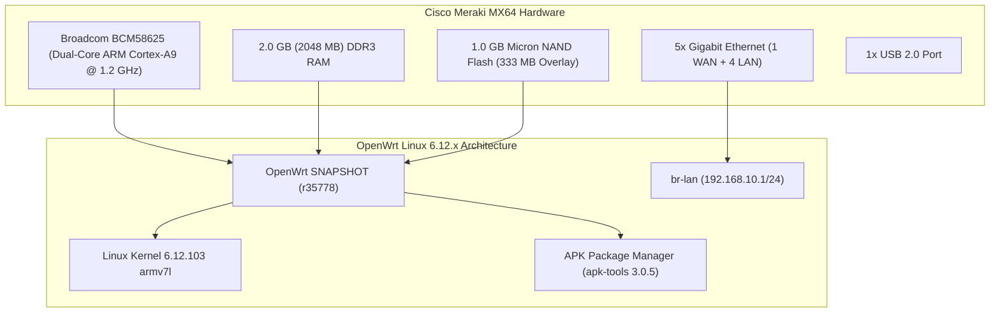

# Cisco Meraki MX64 OpenWrt - Cihaz Blueprint & Referans Kılavuzu

Bu belge, açık kaynaklı **OpenWrt** işletim sistemine dönüştürülmüş Cisco Meraki MX64 cihazının canlı sistem mimarisini, donanım özelliklerini, ağ yerleşimini, paket yöneticisini ve yönetim komutlarını belgeler.

---

## 1. Donanım & Sistem Özellikleri (System Blueprint)



### Canlı Donanım Metrikleri

| Bileşen | Detay | Canlı Değer / Kapasite |
|---|---|---|
| **Cihaz Modeli** | Cisco Meraki MX64 (`meraki,mx64`) | ARMv7 Processor rev 0 (v7l) |
| **İşlemci (CPU)** | Broadcom BCM58625 (Dual-Core) | SMP Linux Kernel 6.12.103 |
| **Toplam Bellek (RAM)** | 2.0 GB DDR3 | **Toplam: 2066 MB** / **Boşta: ~2026 MB** |
| **Kalıcı Depolama (/overlay)** | UBI NAND Flash Bölümü | **333.4 MB Boş Alan** (Paketler için) |
| **Geçici RAM Alanı (/tmp)** | RAMDisk (tmpfs) | **1009.0 MB (~1 GB)** |
| **Paket Yöneticisi** | APK (Alpine Linux standartlı) | `apk-tools 3.0.5` |
| **Açık SSH Portu** | Dropbear SSH v2024.86 | Port 22 (IPv4 & IPv6 açık) |

---

## 2. Ağ Haritası & Port Yerleşimi

```text
[ WAN / Internet ]   [ LAN 1 ]   [ LAN 2 ]   [ LAN 3 ]   [ LAN 4 ]   [ USB 2.0 ]
       │                 │           │           │           │            │
  (Modem Girişi)         └───────────┴─────┬─────┴───────────┘       (4G/Storage)
                                           │
                                  [ br-lan Köprüsü ]
                                   192.168.10.1/24
                                 (DHCP: .100 - .250)
```

| Port | Arayüz Adı | Rol / Görev | Varsayılan Yapılandırma |
|---|---|---|---|
| **WAN (En Soldaki)** | `wan` (`eth0`) | İnternet Girişi (Uplink) | DHCP İstemcisi (Modemden otomatik IP alır) |
| **LAN 1** | `lan1` | Yerel Ağ (Bridge `br-lan`) | Statik: `192.168.10.1` (DHCP Server Aktif) |
| **LAN 2** | `lan2` | Yerel Ağ (Bridge `br-lan`) | `br-lan` üyesi |
| **LAN 3** | `lan3` | Yerel Ağ (Bridge `br-lan`) | `br-lan` üyesi |
| **LAN 4** | `lan4` | Yerel Ağ (Bridge `br-lan`) | `br-lan` üyesi |

---

## 3. Cihaza Erişim Yöntemleri

### A. SSH Bağlantısı (Komut Satırı)
Bilgisayarınızı LAN 1, 2, 3 veya 4 portlarından birine bağlayın:

```bash
ssh root@192.168.10.1
```
* **Kullanıcı:** `root`
* **Şifre:** **YOK (Boş)** — *Enter tuşuna basarak doğrudan giriş yapabilirsiniz.*

---

## 4. Paket Yönetimi & Yeni Yazılım Kurulumu

Bu güncel OpenWrt sürümünde yeni nesil **`apk`** paket yöneticisi kullanılmaktadır.

### Önemli Paket Komutları:

Cihazın WAN portuna internet kablosu taktıktan sonra:

```sh
# Paket depolarını güncelle:
apk update

# Paket arama:
apk search wireguard

# Paket yükleme (Örn: WireGuard VPN):
apk add wireguard-tools kmod-wireguard

# Web Arayüzü (LuCI) Yükleme:
apk add luci
service uhttpd start
service uhttpd enable

# Yüklü paketleri listeleme:
apk list -I
```

---

## 5. Pratik Yönetim Komutları

| Yapılacak İşlem | Komut |
|---|---|
| **Şifre Belirleme** | `passwd` |
| **Sistem Bilgisi** | `ubus call system board` |
| **Bellek Durumu** | `free -m` |
| **Disk / Flash Alanı** | `df -h` |
| **Ağ Arayüzleri** | `ip addr show` veya `ubus call network.interface dump` |
| **Ağ Servisini Yeniden Başlatma** | `/etc/init.d/network restart` |
| **Cihazı Yeniden Başlatma** | `reboot` |
| **Fabrika Ayarlarına Sıfırlama** | `firstboot -y && reboot` |

---

## 6. Güvenlik & Kurtarma Bilgileri
- **Orijinal Stok Meraki Boot Yedeği:** Bilgisayarınızdaki `backups/orig_mtd0_boot_1786722972.bin` dosyasında saklanmaktadır.
- **Acil Durum Kurtarma:** [RECOVERY_GUIDE.md](RECOVERY_GUIDE.md) dosyasında tanımlanan FAT32 USB Acil Initramfs yöntemiyle cihaz her zaman saniyeler içinde RAM üzerinden kurtarılabilir.
